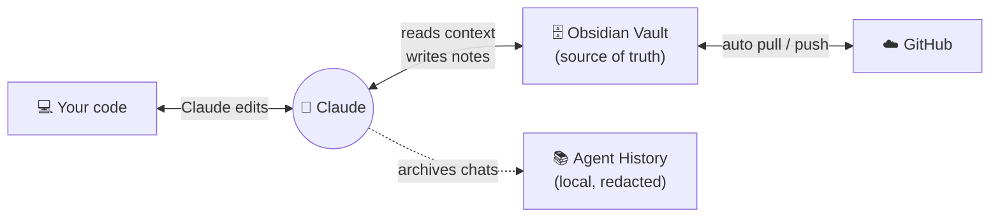
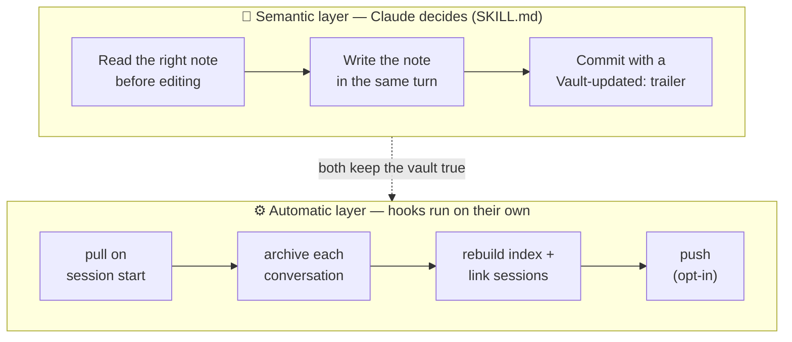
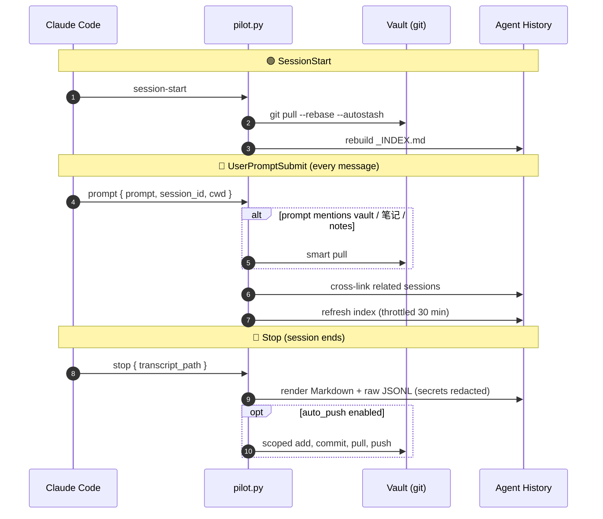
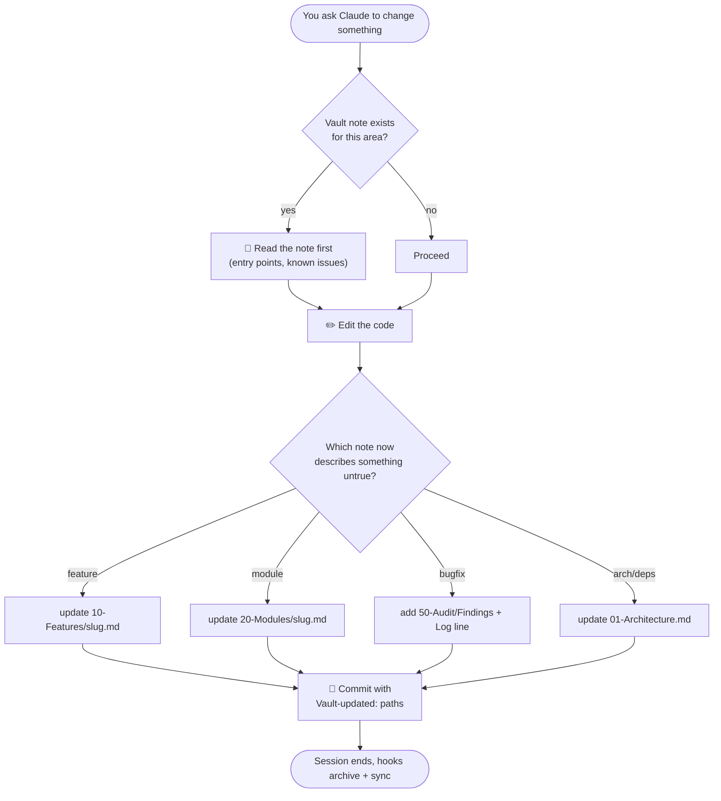
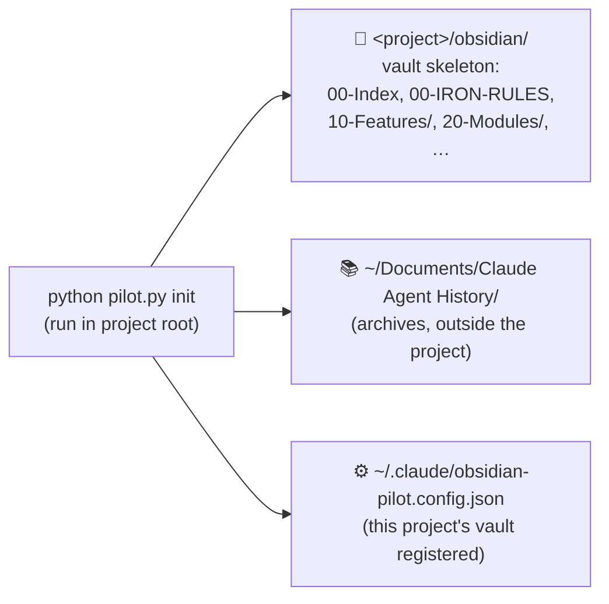
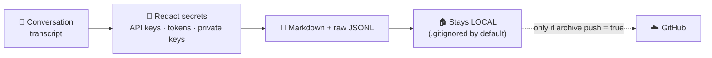

# 🧭 Obsidian Autopilot

> A cross-platform [Claude Code](https://claude.com/claude-code) skill that turns an **Obsidian vault into the single source of truth for your codebase** — and keeps it that way automatically.

Claude reads the right notes before it changes code, writes structured notes
*as* it changes code, archives every conversation, cross-links related sessions,
and git-syncs the vault. One pure-Python toolkit. **macOS · Linux · Windows.**



---

## Table of contents

- [Why this exists](#-why-this-exists)
- [What was wrong with the old way](#-what-was-wrong-with-the-old-way)
- [How it works](#-how-it-works)
- [The dynamic workflow](#-the-dynamic-workflow)
- [Install](#-install)
- [Configuration](#-configuration)
- [Security model](#-security-model)
- [Cross-platform notes](#-cross-platform-notes)
- [Command reference](#-command-reference)
- [Project layout](#-project-layout)

---

## 💡 Why this exists

If you keep an Obsidian vault that documents a project, the documentation rots
the moment code and notes drift apart. The cure is a discipline — *change the
note in the same breath as the code* — plus plumbing that handles the
mechanical parts (syncing, archiving, indexing) so you never think about them.

Obsidian Autopilot is that discipline **encoded as a Claude skill** plus that
plumbing **encoded as three lifecycle hooks**.



---

## 🔍 What was wrong with the old way

This skill is a ground-up rewrite of a working-but-brittle setup. The redesign
fixed concrete problems — worth listing, because they are the problems *any*
home-grown version hits:

| # | Problem in the old setup | Fix in Autopilot |
|---|--------------------------|------------------|
| 1 | **Windows-only.** Six `powershell.exe` scripts with GBK-encoding workarounds. | One pure-Python toolkit; runs identically on all three OSes. |
| 2 | **Hardcoded paths.** A user's absolute path baked into every script. | Everything lives in one config file; nothing is hardcoded. |
| 3 | **🔴 Security leak.** Full transcripts (tool results with API keys, file contents) auto-pushed to GitHub via `git add -A`. | Archives stay **local by default**, are **secret-redacted**, and pushing is **opt-in**. Staging is scoped, never `add -A`. |
| 4 | **Process storm.** 3–6 detached shells spawned on *every* prompt. | One dispatcher process per lifecycle event. |
| 5 | **Brittle triggers.** Hardcoded project names in a keyword regex. | Per-vault, configurable, bilingual keywords. |
| 6 | **Copy-pasted plumbing.** Lock/throttle logic reimplemented in each script. | A single locking + throttling primitive, reused everywhere. |
| 7 | **No observability.** Logs scattered, no way to check health. | `pilot.py status` and `pilot.py doctor`. |
| 8 | **Single vault assumed.** | Config holds an array of vaults. |

---

## 🛠️ How it works

Two layers, one vault.

**Automatic layer** — three hooks registered in `~/.claude/settings.json`,
each calling one dispatcher (`pilot.py <event>`):



**Semantic layer** — `SKILL.md`. Claude loads it whenever your work touches a
configured vault, and follows the read-before / write-with / commit-trailer
rules. This is the part that keeps the *content* honest; the hooks only keep the
*mechanics* honest.

---

## 🔄 The dynamic workflow

What actually happens across one unit of work:



> **The one rule:** a vault note and the code it documents change together, in
> the same unit of work — never "edit now, fix the note later." If the note lags
> the code, the knowledge chain is broken.

---

## 📦 Install

**Requirements:** Python 3.8+ and git. No pip packages — pure standard library.

```bash
# 1. Clone anywhere
git clone https://github.com/SuzumiyaHaruhi719/claude-obsidian-autopilot.git
cd /path/to/claude-obsidian-autopilot

# 2. Register the lifecycle hooks in Claude Code (once per machine)
python /path/to/claude-obsidian-autopilot/pilot.py install

# 3. In EACH project you want documented, run init from the project root:
cd ~/code/my-project
python /path/to/claude-obsidian-autopilot/pilot.py init

# 4. Verify
python /path/to/claude-obsidian-autopilot/pilot.py doctor
```

### What `init` does

Run it from a project root and it scaffolds everything for you:



- The **vault lives next to your code** at `<project>/obsidian` — versioned with
  the project, no separate repo to manage.
- **Conversation archives default to `~/Documents`**, deliberately *outside* the
  project so transcripts never pollute (or leak into) your code repo.
- `init` is **additive and idempotent** — run it in each new project; existing
  files are never overwritten.

To make Claude follow the **semantic** workflow too, expose the skill — either
symlink/copy the repo into `~/.claude/skills/obsidian-autopilot/`, or install it
as a plugin. Claude will then load `SKILL.md` automatically when your work
touches a configured vault.

Uninstall cleanly at any time:

```bash
python pilot.py uninstall   # removes only this skill's hooks; backs up settings.json
```

---

## ⚙️ Configuration

One file: `~/.claude/obsidian-pilot.config.json` (or set `OBSIDIAN_PILOT_CONFIG`).

```jsonc
{
  "vaults": [
    {
      "name": "MyProject",
      "path": "~/Documents/Obsidian/MyProject/Knowledge", // notes Claude reads/writes
      "git_root": "~/Documents/Obsidian/MyProject",       // where git runs
      "auto_pull": true,
      "auto_push": false,                                  // opt-in; off by default
      "pull_keywords": ["obsidian", "vault", "笔记", "MyProject"],
      "push_paths": []                                     // [] = whole repo minus ignores
    }
  ],
  "archive": {
    "enabled": true,
    "dir": "~/Documents/Obsidian/MyProject/Agent History",
    "push": false,            // archives stay LOCAL unless you flip this
    "include_thinking": true,
    "redact_secrets": true
  },
  "organize":      { "enabled": true, "throttle_seconds": 1800 },
  "link_sessions": { "enabled": true },
  "pull_throttle_seconds": 30
}
```

`~` and environment variables are expanded. Forward slashes work on Windows too.

---

## 🔒 Security model



- **Archives never leave your machine** unless you set `archive.push: true`.
- **Secret redaction** masks AWS keys, GitHub/Slack/OpenAI tokens, bearer tokens,
  private-key blocks and `key=value` secrets before anything is written.
- **A managed `.gitignore` block** keeps `*.raw.jsonl`, the Agent-History folder,
  and credential files out of every push — automatically.
- **No `git add -A`.** Staging is scoped to configured content paths.
- `install` **backs up** your `settings.json` and never clobbers unrelated hooks.

---

## 🌍 Cross-platform notes

| Concern | How it's handled |
|---------|------------------|
| Python launcher | `install` writes the absolute path of the active interpreter (`python`/`python3`/venv). |
| Paths | `pathlib` + `~`/env expansion; forward or back slashes both work. |
| File encoding | All reads/writes are UTF-8, no BOM — Obsidian- and git-friendly. |
| Atomic writes | temp-file + `os.replace`, atomic on NTFS, APFS and ext4. |
| Claude config dir | Honors `CLAUDE_CONFIG_DIR`; defaults to `~/.claude`. |
| Locks / throttles | OS-agnostic stamp files; stale locks auto-reclaimed. |

---

## 📟 Command reference

| Command | Purpose |
|---------|---------|
| `python pilot.py init` | Scaffold `<project>/obsidian`, archive dir in `~/Documents`, register the vault (run in a project root) |
| `python pilot.py install` | Register the three lifecycle hooks |
| `python pilot.py uninstall` | Remove this skill's hooks (others untouched) |
| `python pilot.py status` | Show resolved config + recent sync log |
| `python pilot.py doctor` | Check git, python, paths, remotes |
| `python pilot.py sync` | Manually pull + push every vault now |
| `python pilot.py session-start \| prompt \| stop` | Hook entry points (read JSON on stdin) |

---

## 🗂️ Project layout

```
claude-obsidian-autopilot/
├── pilot.py                  # single entry point: hooks + CLI
├── SKILL.md                  # the semantic workflow Claude follows
├── config.example.json       # config template
├── README.md
└── obsidian_pilot/           # pure-stdlib package
    ├── util.py               # paths, logging, locking, atomic writes
    ├── config.py             # discovery, schema, defaults
    ├── gitsync.py            # throttled pull/push + managed .gitignore
    ├── archive.py            # transcript -> Markdown + secret redaction
    ├── organize.py           # rebuild Agent-History index
    ├── linker.py             # cross-link related sessions
    ├── scaffold.py           # init: create the vault skeleton
    └── installer.py          # register/remove hooks in settings.json
```

---

## License

[MIT](LICENSE) © 2026 SuzumiyaHaruhi719

🤖 Generated with [Claude Code](https://claude.com/claude-code)
